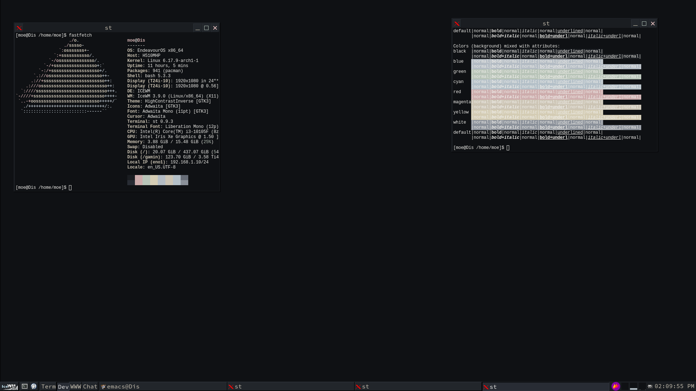

# compline-ice

A port of Compline for IceWM

## Installation
```git clone https://codeberg.org/xiiixvv/compline-ice.git```

Place folder into
```~/.icewm/themes/```
or
```/usr/shae/icewm/themes/```

Apply the theme through the settings menu.



### Notes
Terminal colors separate from this theme.
Font is the SauceCodePro Nerd Font
